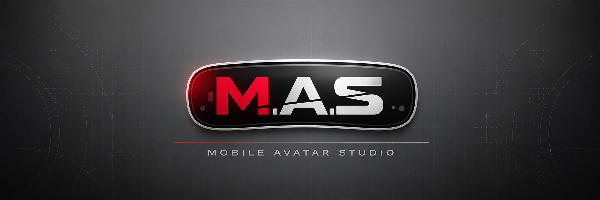

  

# M.A.S. Mobile Avatar Studio

Mobile Avatar Studio is an editor-only Unity package for preparing VRChat avatars for Android and iOS mobile platforms. It creates a separate mobile counterpart while protecting the original PC avatar.

This is the official `0.1.0` release of M.A.S. Mobile Avatar Studio. It is open source under the MIT license.

**[Add M.A.S. Mobile Avatar Studio to VCC](https://justyaz.github.io/mobile-avatar-studio/)**

If the button does not open VCC, copy this repository URL into `VCC > Settings > Packages > Add Repository`:

`https://justyaz.github.io/mobile-avatar-studio/index.json`

## Quick install

For a normal user, choose the `com.redjohn.mobile-avatar-studio-0.1.0.zip`, `.tgz`, or `.unitypackage` asset from the [v0.1.0 release](https://github.com/JustYaz/mobile-avatar-studio/releases/tag/v0.1.0). Use the ZIP or TGZ with Unity Package Manager/VCC; use the UnityPackage for a direct Unity import. For the latest development version, use this Git URL:

`https://github.com/JustYaz/mobile-avatar-studio.git`

## Video tutorial

Follow the [M.A.S. setup tutorial on YouTube](https://youtu.be/dObcczyokkk) for a guided walkthrough of the installation and workflow.

## What this tool does

The Studio guides you through the difficult parts of making a mobile version of an existing VRChat avatar:

- inspect the source avatar without modifying it;
- generate several mesh-quality candidates, including the untouched original;
- split supported 4x4 UV-tiled meshes into independently selectable pieces;
- review and approve mobile shader mappings instead of silently guessing;
- apply Android/iOS texture compression and size overrides while preserving PC settings;
- preserve approved materials, menus, parameters, toggles, fallbacks, and animation behavior where mobile supports them;
- exclude optional mobile content while keeping reversible restore information;
- run VRChat and avatar build systems on a disposable validation copy;
- build the clean mobile prefab through the official VRChat SDK; and
- measure the real Android/iOS bundle size before upload.

The Studio does not upload avatars, modify the PC prefab, or silently delete source assets.

## Requirements

- Unity 2022.3.
- A VRChat Avatars project created through VRChat Creator Companion.
- The VRChat Avatars SDK installed and working.
- The avatar's own shaders, packages, and build systems installed before analysis.
- Android and/or iOS platform modules when those targets are tested.
- AutoLOD is optional. If it is installed locally, the Studio can use it to generate mesh candidates. AutoLOD is not bundled.

## Supported integrations

The release is built and verified against Unity `2022.3` and the VRChat Avatars SDK baseline declared in `package.json` (`>=3.8.1`). VRCFury, Modular Avatar, NDMF, GoGoLoco, and other avatar build systems are optional project integrations: the Studio detects and validates systems installed in the user's project, but does not bundle them or promise identical behavior across every version. Test the exact versions used by your avatar.

A VCC/VPM community listing is available for installing and updating Mobile Avatar Studio. Exact compatibility with optional avatar build systems depends on the versions installed in the user's project.

## Installation

### TGZ installation

1. Open `Window > Package Manager` in Unity.
2. Choose `+ > Add package from tarball...`.
3. Select `com.redjohn.mobile-avatar-studio-0.1.0.tgz`.
4. Wait for Unity to finish compiling.
5. Open `Tools > Mobile Avatar Studio > Open`.

### ZIP installation

1. Extract `com.redjohn.mobile-avatar-studio-0.1.0.zip`.
2. Open `Window > Package Manager` in Unity.
3. Choose `+ > Add package from disk...`.
4. Select the extracted folder's `package.json`.
5. Wait for Unity to finish compiling.

### UnityPackage installation

1. In Unity, choose `Assets > Import Package > Custom Package...`.
2. Select `mas-mobile-avatar-studio-0.1.0.unitypackage`.
3. Import the package files and wait for Unity to finish compiling.

### Git installation

Open `Window > Package Manager`, choose `+ > Add package from git URL...`, and enter:

`https://github.com/JustYaz/mobile-avatar-studio.git`

The Git URL follows the `main` branch. Use the tagged release ZIP when you need a reproducible version.

### VCC/VPM installation

Add this community listing URL in VCC under `Settings > Packages > Add Repository`:

`https://justyaz.github.io/mobile-avatar-studio/index.json`

Then add **M.A.S. Mobile Avatar Studio** to the project. The listing contains the official `0.1.0` release.

## Basic workflow

The Studio uses a resumable eight-stage workspace. Work through the stages in order and save whenever the Studio offers a checkpoint.

### 1. Overview

Select the PC source prefab and analyze it. The report records renderers, materials, textures, expression assets, animation bindings, build systems, particles, PhysBones, colliders, contacts, and other mobile-relevant components.

The source prefab is treated as protected input. Generated files are written under `Assets/MobileAvatarStudioGenerated` in a separate GUID-scoped workspace.

### 2. Meshes

Review each renderer. Supported UV-tiled renderers can be split into independently selectable pieces before candidate generation. Each piece can keep its original mesh or use a quality-reviewed reduction candidate. Use the preview controls to inspect a piece before approving it.

Keep the original candidate when a reduction damages hair strands, clothing edges, silhouettes, blendshapes, or deformation. The balanced candidate is intended as a practical middle option, not an automatic guarantee.

### 3. Materials

Review every source-to-mobile shader mapping. Approve only mappings that preserve the intended surface. Opaque, cutout, transparent mesh, additive particle, and multiply particle evidence are evaluated separately. Particle shaders are not assigned to ordinary opaque clothing merely because a source shader has an unusual render queue.

Metallic, matcap, emission, hue/color controls, transparency, and animated material properties remain separately reviewable. The Studio does not silently merge special materials or atlas them in this stage.

### 4. Textures

Review base-color, normal, emission, packed-mask, matcap, and other texture groups independently. Apply Android/iOS-only max-size and compression overrides. PC/Standalone texture settings are preserved.

Duplicate UV texture references can be shared when the source data is truly identical. This reduces redundant mobile assets without changing the source texture.

### 5. Assemble

Build the isolated mobile mesh/material draft. Material-slot edits are cached so later rebuilds can restore manual assignments by renderer path. The generated output is separate from the PC prefab.

### 6. Behavior

Copy and remap the mobile behavior graph on isolated assets. Unsupported animated shader properties require an explicit static fallback or remain blocked. Excluded UV-split content is removed from mobile-only material slots and its behavior is handled only when the Studio can prove the result is safe.

When Stage 6 finishes, perform the manual mobile-material polish pass. Adjust shaders, matcaps, emission, transparency, and visual settings to your preference, then use `Save Manual Work & Rescan`. Stage 7 stays locked until the final texture dependencies have approved Android/iOS settings.

### 7. Fix & Validate

The Studio validates a disposable clone after VRCFury and other installed build systems run. It exposes exact ParticleSystem, PhysBone, collider, contact, and unsupported-component paths. Select only the components you do not want on mobile, then apply the removals.

Applied removals are stored in a restore cache. They affect the generated mobile prefab only and can be restored later. The clean upload prefab is not the temporary VRCFury test copy.

Warnings still need visual review. In particular, particles, PhysBones, affected transforms, and build-system behavior must be checked against the official VRChat SDK report.

### 8. Build

Run the official SDK mobile build for Android and/or iOS. The Studio records compressed and uncompressed measurements and does not upload the avatar. Upload only after testing the generated prefab with VRChat Build & Test and a second client.

## Minimal example

For a first test, use a copy of an avatar in a separate Unity project:

1. Install the avatar's required packages and open the source PC prefab.
2. Analyze it in Stage 1 and confirm the renderer/material counts are believable.
3. In Stage 2, preview candidates and keep Original for anything that loses visible quality.
4. Approve safe material mappings and texture settings in Stages 3–4.
5. Assemble the draft, complete the manual material-polish pass, and save it in Stage 6.
6. Run Stage 7 for Android and/or iOS, resolve errors, and review warnings visually.
7. Run Stage 8 and compare measured size with the official SDK report.
8. Use Build & Test to exercise toggles, fallbacks, menus, animations, materials, PhysBones, particles, and contacts before uploading.

## Safety guarantees

- The PC source prefab, PC materials, PC textures, and PC behavior assets are not edited by the conversion workflow.
- Generated assets are isolated under `Assets/MobileAvatarStudioGenerated`.
- Shader mappings and ambiguous behavior translations require review instead of silent data loss.
- Exclusions are mobile-only and reversible through the restore cache.
- VRCFury and other avatar build systems run on disposable validation clones.
- A generated prefab is not considered ready merely because it exists; Stage 7 and the official SDK build must pass.

## Important limitations

No automatic converter can guarantee that every PC avatar will look or behave identically on mobile. Some shaders, particles, PhysBones, contacts, animation-driven material effects, and build-system components require creator decisions. Always inspect the avatar in Unity and use VRChat Build & Test before uploading.

This package contains only Mobile Avatar Studio source and documentation. It does not include AutoLOD, Mesh Baker, VRChat SDK binaries, VRCFury, Modular Avatar, NDMF, paid shaders, paid avatar assets, or development avatar content. Those remain dependencies of the user's own project and must be installed under their respective licenses.

## Troubleshooting

- **A material mapping is blocked:** choose a verified mobile shader target and approve the exact mapping. Unsupported animated properties need an explicit static fallback.
- **The avatar becomes bald or empty after a toggle:** return to Stage 6/7 and configure a proven mobile fallback for the excluded object. The Studio blocks unresolved fallbacks to avoid producing that state.
- **Texture settings appear unapproved:** rescan Stage 4 after the final manual material pass, then approve the Android and iOS profiles.
- **A PhysBone or particle warning remains:** inspect the exact component listed in Stage 7 and confirm it against the official SDK report. Warnings are not automatically safe.
- **Unity reports invalid package dependencies:** verify that the package ZIP or TGZ contains `package.json` at its root and that the package is installed from the official `0.1.0` release.
- **A build-system error names missing files:** install the avatar's required package (for example VRCFury or GoGoLoco) in the test project before running Stage 7.

## Testing and bug reports

Use a separate Unity project and an avatar unrelated to the development avatar. Test both Android and iOS when possible, and test menus, synced toggles, fallbacks, animations, PhysBones, contacts, particles, materials, and avatar visibility with a second client.

For a useful issue report, include:

- Unity and VRChat SDK versions;
- installed avatar build systems;
- active mobile target;
- failing Studio stage;
- exact Console error or dialog text;
- the generated report path under `Assets/MobileAvatarStudioGenerated/<AvatarJob>/Current/Reports`; and
- whether the problem reproduces after reopening the saved recipe.

Do not upload a private avatar, credentials, or generated workspace unless its license permits it.

## Contributing

Read `CONTRIBUTING.md` before changing production code. Keep mobile compromises explicit, reviewable, reversible, and generic. Do not add avatar-specific paths or assumptions to the package.

## Documentation

- [Installation and testing](Documentation~/InstallationAndTest.md)
- [Compatibility matrix](Documentation~/Compatibility.md)
- [Known issues](Documentation~/Known-Issues.md)
- [Product direction](Documentation~/ProductDirection.md)

## License

MIT. See `LICENSE`.
